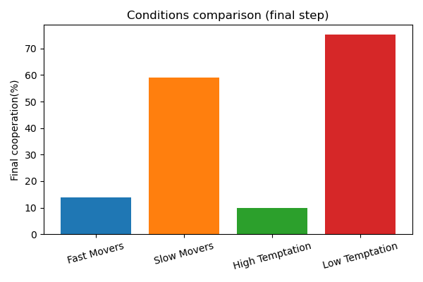

# CompPhy2_actor-based-simulation
This is a school project for the School of engineering HES-SO Valais//Wallis. It is for the _205.1 Functional programming_ and _204.2 Computational Physics 2_ classes. 

## Context 
In the wake of repeated epidemic waves, public‐health authorities need to understand how—and under what conditions—control measures (masking, social distancing, vaccination, etc.) spread through a population.  
This project, **“Adoption of Rules in Societies,”** explores how simple behavioral rules propagate (or fail to propagate) when individuals repeatedly interact via a spatial Prisoner’s Dilemma. We vary key parameters—agent speed, temptation to defect, initial fraction of cooperators, etc.—and observe emergent outcomes such as overall cooperation levels and clusters of cooperators (or defectors).

## Our model
We implement an agent‐based model in Scala with the following features:

- **Agents** move randomly in a 2D square.  
- At each discrete time step, each agent plays Prisoner’s Dilemma against nearby neighbors (within a radius r).  
- Payoffs use the standard ordering:  
  - Reward for mutual cooperation 
  - Temptation to defect 
  - Sucker’s payoff 
  - Punishment for mutual defection  
- After each round, each agent may adopt the strategy of a randomly selected neighbor with probability `adoptionChance` proportional to payoff difference.  
- We track two global metrics over time:  
  1. **% Cooperators** (blue curve)  
  2. **Number of Cooperator Clusters** (red curve; contiguous groups of cooperators)

## Parameters
- `nAgents` (100–5000)           –– Total agents
- `coopRatio` (0-1)             –– Initial fraction of cooperators
- `coopCityFrac` / `defCityFrac` –– Fraction of cooperators and defects in cities
- `steps` (10-10000)  –– number of steps
- `radius` (0.1-5.0)  –– interaction radius
- `speed` (0.1-2.0)  –– movement speed
- `temptation` T (1.0-5.0)  –– Temptation
- `adoptionChance` (0.0-1.0) –– chance of agent to adopt others strategy

## Interface :
**Interactive JavaFX UI**: live animation, parameter sliders, pause/resume, and “Export CSV” button.

## Code structure :

### Agent.scala
Immutable representation of a single agent in the spatial Prisoner’s Dilemma:

- **Fields**  
  - `id: Int` — unique identifier  
  - `x, y: Double` — continuous position in the world  
  - `isCooperator: Boolean` — current strategy (C or D)  
  - `points: Double` — accumulated payoff this round  
  - `coolDown: Int` — steps before the agent can change strategy again  

- **Behavior**  
  - `playRound(opponent, R, P, S, T): Agent`  
    Plays one prisoner's dilemma encounter with another agent, adds the appropriate payoff (R/P/S/T) to `points`, and returns an updated Agent.  
  - `move(speed, worldSize, rng): Agent`  
    Chooses a random direction, steps by `speed`, clamps into `[0, worldSize]²`, and returns the moved Agent.  

### City.scala
Defines a circular “city” region that influences agent initialization and dynamics:

- `x, y: Double` — center coordinates in world space  
- `radius: Double` — city radius; agents within this circle are treated as in a city  

### World.scala
Immutable container for the entire simulation state at one time step:

- `agents: Seq[Agent]` — all agents with their positions and strategies  
- `worldSize: Double` — length of the square world’s side (coordinates run from 0 to `worldSize`)  
- `interactionRadius: Double` — distance threshold for two agents to play the Prisoner’s Dilemma  
- `cities: Seq[City]` — list of all city regions used during initialization (and optionally for zone-based rules)

### Simulation.scala
Contains the core, pure‐functional engine driving the model:

- **`initializeWorld(...)`**  
  - Creates `nAgents` with a given global cooperation ratio, splits them into “city” vs countryside populations, and places them at random coordinates.  

- **`step(world, speed, adoptionChance, temptation, rng)`**  
  - **Moves** each agent by `speed` in a random direction.  
  - **Plays** a Prisoner’s Dilemma (payoffs R/P/S/T) with all neighbors within `interactionRadius`.  
  - **Adopts** the most successful neighbor’s strategy with probability `adoptionChance`.  
  - **Resets** each agent’s accumulated points (and any cooldown timers).  

- **`countCooperatorClusters(world)`**  
  - Filters cooperators and counts connected components (clusters) in the neighborhood graph—useful for exporting spatial‐cluster statistics.
 

### Simulation_interface.scala
Implements the interactive ScalaFX front‐end:

- **Parameter inputs** (TextFields):  
  - Number of agents, initial coop ratio, city‐bias fractions, steps, interaction radius, speed, temptation T, adoption chance.  
- **Buttons**:  
  - **Start** / **Restart** → initialize a new run  
  - **Pause** / **Resume** → toggle live animation  
  - **Export CSV** → write per‐step, per‐agent data (including cluster counts) to `output/simulation-data.csv`  
- **Visualization**:  
  - **Canvas** shows moving agents (green = C, red = D) and city boundaries in real time.  
  - **Line chart** tracks % Cooperators vs % Defectors over time.  
- **Animation loop** (`AnimationTimer`):  
  1. Calls `Simulation.step(...)` each frame  
  2. Appends agent snapshots to history  
  3. Updates the chart with the latest cooperation percentages  
  4. Renders the agents and cities on the canvas  

This class glues together the core model, the user controls, and real‐time visual feedback.  

### Main.scala
Simulation and JSON export:

- **Parameters** (constants at top):  
  - `nAgents`, `coopRatio`, world dimensions, `interactionRadius`, city definitions  
  - Simulation settings: `nSteps`, `speed`, `temptation`, `adoptionChance`  
  - `outputFile` path for JSON dump  

- **`main`** method:  
  1. Initializes a `World` via `Simulation.initializeWorld`, placing cooperators/defectors inside cities vs countryside.  
  2. Runs `nSteps` iterations of `Simulation.step`, accumulating each generation’s `agents` snapshot in a list.  
  3. Serializes the full history to a JSON array (`[ [ {id,x,y,strategy}, … ], … ]`) and writes it to `outputFile`.  
  4. Prints a confirmation message with the number of frames written.
 

## How to run 
In a terminal write `sbt run` and then input `2` to chose the interface. It will open an UI with values that can be changed for simulation. 

## Visuals 

### Simulation video :

### Plots :

 **Initial Cooperation vs. Outcomes**
 

*Final cooperation rate (blue) and cooperator cluster count (red) across different initial cooperation ratios.*  

**Scenario Comparison**

*Final cooperation percentage for fast movers, slow movers, high temptation, and low temptation scenarios.*  

